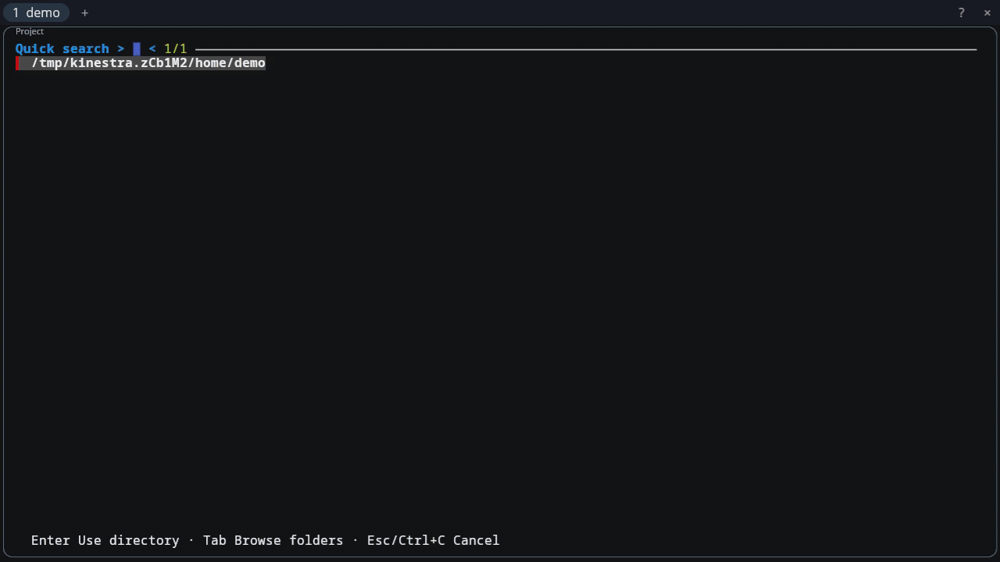

# Eon

*Build for Eons.*


Eon is a terminal workspace for the native Linux desktop. Close its window and
your Sessions keep running; open Eon again to reconnect. Tabs and panes share a
managed environment with Nushell, Helix, Yazi, and other pinned tools.
`eonterm` runs one command with the same Session lifecycle.

## Demo

[](assets/demo/eon-demo.mp4)

[Watch the MP4](assets/demo/eon-demo.mp4) of the real Nix alpha on a private
Wayland display. [Regenerate the demo](docs/DEVELOPMENT.md#demo-media).

## Get started

The Nix-only alpha supports **x86_64 Linux on native Wayland**. You need Git,
Nix with flakes enabled, and a Wayland session. [Platform details](docs/USAGE.md#supported-environment)
cover the proved setup and current limits.

```sh
git clone https://github.com/Yazelix/eon.git
cd eon
nix profile add .#default
eon
```

The first launch asks for a directory. Press Enter for a Zoxide match, or Tab to
browse with Yazi. Closing the window leaves Sessions alive; `eon attach` returns
to them. **Alt+/** opens the shortcut guide in the window.

To end Sessions explicitly, inspect `eon generations`, then run
`eon stop GENERATION`, `eon stop previous`, or `eon stop all`.

## Guides

- [Using Eon](docs/USAGE.md): workspace controls, commands, EonTerm, and troubleshooting.
- [Configuration](docs/CONFIGURATION.md): terminal, shell, popups, and managed tools.
- [Development](docs/DEVELOPMENT.md): component owners, proofs, and maintainer checks.
- [Contracts](docs/CONTRACTS.md) and [architecture](docs/ARCHITECTURE.md): exact product boundaries and evidence.
- [Changelog](CHANGELOG.md): accepted user-visible changes.

## LOC scorecard

The scorecard counts tracked handwritten text and code. It excludes `.git/`,
Beads data, lock files, and generated artifacts.

| Surface | Lines |
|---|---:|
| Agent policy inputs | 269 |
| README | 71 |
| Repository ignore rules | 3 |
| License | 201 |
| Third-party notices | 37 |
| Binding license notice | 21 |
| Architecture and contracts | 2,168 |
| Distribution and references | 720 |
| User guides | 272 |
| Development guide | 46 |
| Benchmark report | 317 |
| Changelog | 360 |
| Rust source and tests | 16,868 |
| Cargo manifests | 38 |
| Component manifest | 355 |
| Nix composition | 815 |
| Product defaults | 0 |
| **Total** | **22,561** |
